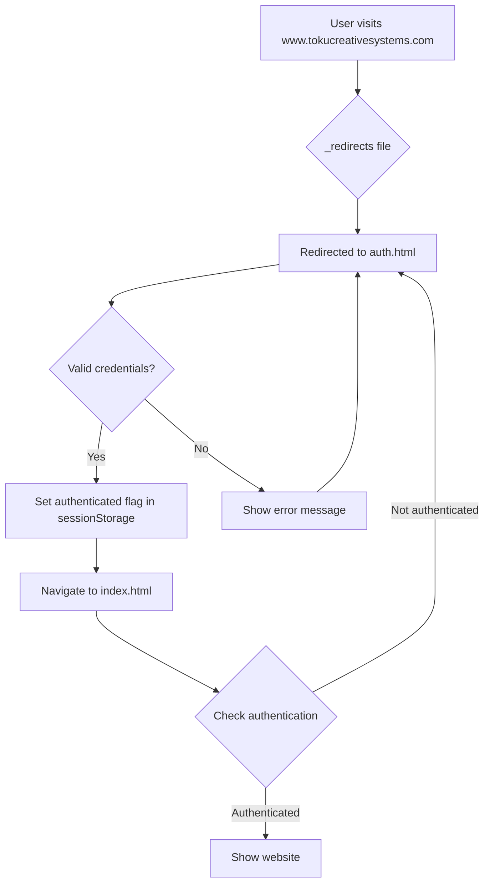

# 🔐 Password-Protected Deployment Setup Complete

Your Toku Creative Systems website is now configured for password-protected deployment on Cloudflare Pages.

## What's Been Set Up

### 🔑 Authentication Files Created

1. **`auth.html`** - Beautiful login page with:
   - Toku logo (using logo-wordmark.png)
   - Username and password fields
   - Sleek dark theme matching your site
   - Form validation and error handling

2. **`_redirects`** - Cloudflare redirect rules:
   - Forces all visitors to the login page
   - Works automatically on Cloudflare Pages

3. **`index.html`** (modified) - Added protection:
   - Checks authentication on page load
   - Redirects to login if not authenticated
   - Uses session storage (clears on browser close)

## Default Login Credentials

```
Username: toku
Password: dev2024
```

> ⚠️ **CHANGE THIS** before deploying! Edit line 102 in `auth.html`

## Quick Start

### 1. Test Locally

Open `auth.html` in your browser and test the login flow.

### 2. Deploy to Cloudflare Pages

See full instructions in [`DEPLOYMENT.md`](./DEPLOYMENT.md)

**Quick version:**

```bash
git init
git add .
git commit -m "Initial commit with password protection"
git remote add origin https://github.com/YOUR-USERNAME/toku-website.git
git push -u origin main
```

Then connect to Cloudflare Pages dashboard and deploy!

### 3. Add Your Custom Domain

In Cloudflare Pages settings:

- Add `www.tokucreativesystems.com`
- Add `tokucreativesystems.com`

## How It Works



## When You're Ready to Go Live

### Remove Password Protection

1. Delete the `_redirects` file:

   ```bash
   git rm _redirects
   ```

2. Comment out the auth check in `index.html` (lines 20-27)

3. Push changes:

   ```bash
   git add .
   git commit -m "Remove password protection - going live!"
   git push
   ```

Cloudflare automatically redeploys your site publicly!

## File Structure

```
toku-website/
├── auth.html              # 🔐 Login page (NEW)
├── _redirects             # 🔀 Redirect rules (NEW)
├── index.html             # 🏠 Main site (MODIFIED)
├── styles.css             # 🎨 Styles
├── script.js              # ⚡ Interactions
├── logo.png               # 🖼️ Logo
├── logo-wordmark.png      # 🖼️ Wordmark
├── favicon.png            # 🎯 Favicon
├── DEPLOYMENT.md          # 📖 Full deployment guide
├── LOGO-GUIDE.md          # 🎨 Logo guidelines
├── EX-MACHINA-LOGO.md     # 🤖 Logo concepts
└── README.md              # 📄 This file
```

## Security Level

This setup provides:

✅ **Development privacy** - Hide work-in-progress  
✅ **Search engine protection** - Won't be indexed  
✅ **Basic access control** - Simple login gate  

⚠️ **This is NOT enterprise security!** It's client-side JavaScript authentication, perfect for development but not for protecting sensitive data.

## Need More Security?

For production-grade authentication:

- **Cloudflare Access** - Enterprise solution (paid plans)
- **Cloudflare Workers** - Server-side authentication
- **Third-party services** - Auth0, Firebase, etc.

See [`DEPLOYMENT.md`](./DEPLOYMENT.md) for details.

## Customization

### Change Password

Edit `auth.html` line 102:

```javascript
const VALID_CREDENTIALS = {
    username: 'toku',
    password: 'YOUR-PASSWORD-HERE'
};
```

### Change Logo

Replace `logo-wordmark.png` or edit line 97 in `auth.html`

### Styling

The login page matches your site's dark theme. Customize the CSS in `auth.html` (lines 8-153).

## Support

- 📖 Full guide: [`DEPLOYMENT.md`](./DEPLOYMENT.md)
- 💬 Cloudflare Docs: <https://developers.cloudflare.com/pages/>
- 🌐 Cloudflare Community: <https://community.cloudflare.com/>

---

**Ready to deploy?** Follow the steps in [`DEPLOYMENT.md`](./DEPLOYMENT.md)! 🚀

*Built with ❤️ for Toku Creative Systems Limited*
